# 01 — Concept Map
## Smart Desk Assistant (SDA)

### Purpose
A concept map identifies the **core ideas** of the system and shows how they relate. It establishes the intellectual territory of the project before any implementation detail is introduced.

---

### Diagram

```mermaid
graph TD
    SDA["Smart Desk Assistant (SDA)"]

    %% ─── Major Concept Branches ───────────────────────────────
    SDA --> IOT["IoT Sensor Node"]
    SDA --> CLOUD["MQTT Connect Cloud"]
    SDA --> BACKEND["Backend Server"]
    SDA --> MOBILE["Mobile Application"]
    SDA --> AI["AI Insights Engine"]
    SDA --> USER["User / Occupant"]
    SDA --> ENV["Workplace Environment"]

    %% ─── IoT Node ─────────────────────────────────────────────
    IOT --> ESP["ESP32-S3 Microcontroller"]
    IOT --> SENSORS["Analog Sensors"]
    IOT --> FIRMWARE["Firmware (C / ESP-IDF)"]
    IOT --> WIFI["Wi-Fi Connectivity"]
    IOT --> MQTT_PUB["MQTT Publisher (TLS)"]

    SENSORS --> GAS["Gas / Air Quality Sensor\n(GPIO 4, ADC1-CH3)\n0 – 1000 ppm"]
    SENSORS --> MIC["Microphone / Noise Sensor\n(GPIO 5, ADC1-CH4)\n30 – 130 dB"]
    SENSORS --> LDR["LDR / Light Sensor\n(GPIO 6, ADC1-CH5)\n0 – 1000 lux"]

    FIRMWARE --> RTOS["FreeRTOS Tasks"]
    FIRMWARE --> PROV["Wi-Fi Provisioning Portal\n(AP Mode + HTTP)"]
    FIRMWARE --> NVS["NVS Credential Storage"]

    RTOS --> BTASK["button_task\n(GPIO 13 reset)"]
    RTOS --> PTASK["publish_task\n(every 5 s)"]

    MQTT_PUB --> TOPICS["MQTT Topics\nstream/gas\nstream/noise\nstream/light"]

    %% ─── Cloud ────────────────────────────────────────────────
    CLOUD --> BROKER["MQTT Broker\nmqtt.protonestconnect.co:8883"]
    CLOUD --> MQTTAPI["REST API\napi.protonestconnect.co"]
    CLOUD --> MQTTWS["WebSocket Stream\nwss://api.protonestconnect.co/ws"]
    CLOUD --> TLS["TLS / Certificate Security"]

    MQTTAPI --> TOKEN["JWT Token Auth"]
    MQTTAPI --> HISTORY["Historical Stream Data"]
    MQTTAPI --> STATE["Device State Records"]

    %% ─── Backend ──────────────────────────────────────────────
    BACKEND --> EXPRESS["Express.js REST API"]
    BACKEND --> WSSERVER["WebSocket Server (/ws)"]
    BACKEND --> DB["PostgreSQL Database"]
    BACKEND --> SYNC["MQTT Connect Sync Service\n(5 s polling)"]
    BACKEND --> AUTHSVC["JWT Authentication"]
    BACKEND --> PUSHSVC["Push Notification Service"]
    BACKEND --> THRESHSVC["Threshold Evaluation"]

    EXPRESS --> ROUTES["API Routes\n/auth /devices /insights\n/user /ingest /mqtt-connect\n/thresholds"]

    DB --> TABLES["Database Tables\nusers, devices\nsensor_readings, insights\nuser_settings, sessions\nmqtt_connect_credentials\nsensor_thresholds\npush_tokens"]

    SYNC --> DEDUP["Duplicate Prevention\n(5 s window grouping)"]
    SYNC --> STATUS["Device Online / Offline\nDetection"]

    %% ─── Mobile App ───────────────────────────────────────────
    MOBILE --> RN["React Native + Expo"]
    MOBILE --> SCREENS["Screens"]
    MOBILE --> CONTEXTS["React Contexts"]
    MOBILE --> HOOKS["Custom Hooks"]
    MOBILE --> APICLIENT["API Client (HTTP + WS)"]

    SCREENS --> AUTH_SCREENS["Auth\n(Login / Register)"]
    SCREENS --> DEV_SCREENS["Devices\n(List / Dashboard)"]
    SCREENS --> RPT_SCREENS["Reports\n(History / Charts)"]
    SCREENS --> INS_SCREENS["Insights\n(AI + Threshold)"]
    SCREENS --> PRF_SCREENS["Profile\n(Settings / MQTT Connect\n/ Thresholds)"]

    CONTEXTS --> AUTHCTX["AuthContext"]
    CONTEXTS --> DEVCTX["DevicesContext"]
    CONTEXTS --> RTCTX["RealtimeContext"]
    CONTEXTS --> THEMECTX["ThemeContext"]

    %% ─── AI Engine ────────────────────────────────────────────
    AI --> GEMINI["Google Gemini API\n(gemini-3.1-flash-lite)"]
    AI --> OPENAI["OpenAI GPT-4o-mini\n(configurable)"]
    AI --> THRESHOLD_INS["Threshold-Based Insights\n(rule engine)"]
    AI --> AI_INS["AI Recommendations\n(LLM-generated)"]

    AI_INS --> COOLDOWN["2-hour Cooldown\n(rate limiting)"]
    AI_INS --> PROMPT["Sensor Context Prompt\n(readings + time of day\n+ trends)"]

    %% ─── User ─────────────────────────────────────────────────
    USER --> HEALTH["Occupant Health\n& Wellbeing"]
    USER --> PRODUCTIVITY["Workplace Productivity"]
    USER --> NOTIF["Push Notifications\n(threshold alerts)"]
    USER --> CONFIG["User Configuration\n(thresholds / MQTT Connect\ncredentials)"]

    %% ─── Environment ──────────────────────────────────────────
    ENV --> AQI["Air Quality Index (AQI)\nExcellent <50 / Good <100\nModerate <150"]
    ENV --> LIGHT_COND["Illuminance\nLow <300 lux\nGood 300–500 lux"]
    ENV --> NOISE_COND["Sound Pressure Level\nQuiet <35 dB\nModerate <50 dB\nLoud <70 dB"]
    ENV --> TEMP_COND["Temperature\nGood 20–26 °C"]
    ENV --> HUMID_COND["Relative Humidity\nGood 40–60 %"]

    %% ─── Cross-cutting ────────────────────────────────────────
    THRESHSVC --> AQI
    THRESHSVC --> LIGHT_COND
    THRESHSVC --> NOISE_COND
    THRESHOLD_INS --> THRESHSVC
    PUSHSVC --> NOTIF
    AI_INS --> INS_SCREENS
    WSSERVER --> RTCTX

    %% ─── Styles ───────────────────────────────────────────────
    style SDA fill:#1a73e8,color:#fff,stroke:#0d47a1,stroke-width:2px
    style IOT fill:#e8f5e9,stroke:#388e3c
    style CLOUD fill:#fff3e0,stroke:#f57c00
    style BACKEND fill:#e3f2fd,stroke:#1565c0
    style MOBILE fill:#fce4ec,stroke:#c62828
    style AI fill:#f3e5f5,stroke:#6a1b9a
    style USER fill:#e0f7fa,stroke:#00838f
    style ENV fill:#f9fbe7,stroke:#827717
```

---

### Key Concept Relationships Explained

| Relationship | Description |
|---|---|
| ESP32-S3 **senses** Environment | Raw analog voltages converted to engineering units via ADC |
| Firmware **publishes via** MQTT Connect | Sensor JSON payloads sent every 5 s over TLS MQTT |
| MQTT Connect **stores and streams** data | Cloud broker persists stream records and exposes REST + WebSocket |
| Backend **syncs from** MQTT Connect | Polling (5 s) + WebSocket bridge pull data into PostgreSQL |
| Backend **evaluates** Thresholds | Rule engine generates warning/critical insights automatically |
| AI Engine **analyses** Sensor Readings | LLM receives sensor context and returns actionable workspace tips |
| Mobile App **displays** all data | Real-time WebSocket readings, charts, insights, reports |
| User **configures** Thresholds | Personalised alert bands stored per-user in database |
| Push Notifications **alert** User | Expo push service delivers threshold breach and offline alerts |
