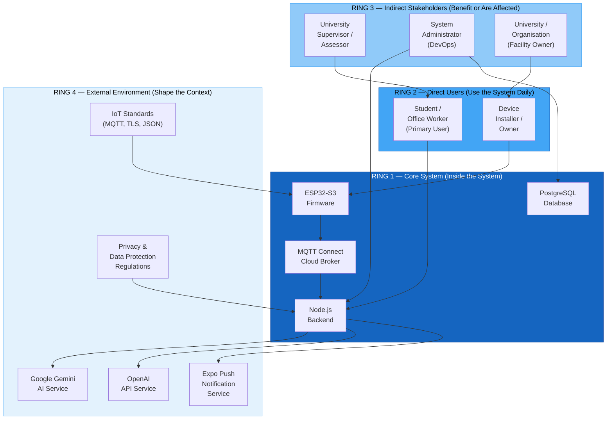

# 03 — Stakeholder Onion Diagram
## Smart Desk Assistant (SDA)

### Purpose
The stakeholder onion diagram organises all parties who have an interest in the system into **concentric rings** based on their proximity to and influence over the system. Those at the centre interact with the system directly; outer rings have indirect or contextual influence.

---

### Diagram



---

### Detailed Onion Description

```
┌──────────────────────────────────────────────────────────────────────────┐
│  RING 4 — EXTERNAL ENVIRONMENT                                            │
│  (Contextual stakeholders — set constraints but do not use the system)    │
│                                                                            │
│   ┌──────────────────────────────────────────────────────────────────┐   │
│   │  RING 3 — INDIRECT STAKEHOLDERS                                   │   │
│   │  (Benefit from or are accountable for the system)                 │   │
│   │                                                                    │   │
│   │   ┌──────────────────────────────────────────────────────────┐   │   │
│   │   │  RING 2 — DIRECT USERS                                    │   │   │
│   │   │  (Operate the system day-to-day)                          │   │   │
│   │   │                                                            │   │   │
│   │   │   ┌──────────────────────────────────────────────────┐   │   │   │
│   │   │   │  RING 1 — CORE SYSTEM                             │   │   │   │
│   │   │   │  (The system itself and its runtime components)   │   │   │   │
│   │   │   │                                                    │   │   │   │
│   │   │   │   • ESP32-S3 Firmware                             │   │   │   │
│   │   │   │   • Node.js Backend                               │   │   │   │
│   │   │   │   • PostgreSQL Database                           │   │   │   │
│   │   │   │   • MQTT Connect Cloud Broker                     │   │   │   │
│   │   │   │   • React Native Mobile App                       │   │   │   │
│   │   │   │                                                    │   │   │   │
│   │   │   └──────────────────────────────────────────────────┘   │   │   │
│   │   │                                                            │   │   │
│   │   │   • Student / Office Worker (Primary End User)            │   │   │
│   │   │   • Device Installer / Hardware Owner                     │   │   │
│   │   │                                                            │   │   │
│   │   └──────────────────────────────────────────────────────────┘   │   │
│   │                                                                    │   │
│   │   • University Supervisor / Thesis Assessor                       │   │
│   │   • System Administrator (DevOps / Deployment)                    │   │
│   │   • University / Organisation (Facility Owner)                    │   │
│   │                                                                    │   │
│   └──────────────────────────────────────────────────────────────────┘   │
│                                                                            │
│   • Google Gemini AI Service         • IoT Industry Standards             │
│   • OpenAI API Service               • Privacy / Data Protection Laws     │
│   • Expo Push Notification Service   • Wi-Fi Infrastructure               │
│                                                                            │
└──────────────────────────────────────────────────────────────────────────┘
```

---

### Stakeholder Register

| Stakeholder | Ring | Role | Primary Interest | Influence Level |
|---|---|---|---|---|
| **ESP32-S3 Firmware** | 1 | Core component | Accurate sensor data acquisition and reliable MQTT publishing | N/A (system) |
| **Node.js Backend** | 1 | Core component | Data persistence, sync, real-time distribution, AI integration | N/A (system) |
| **PostgreSQL Database** | 1 | Core component | Reliable, indexed sensor data and user record storage | N/A (system) |
| **MQTT Connect Broker** | 1 | Core component | Cloud-based MQTT message storage and distribution | N/A (system) |
| **Student / Office Worker** | 2 | Primary user | Real-time environment monitoring, AI health tips, push alerts | High |
| **Device Installer / Owner** | 2 | Hardware operator | Easy provisioning, reliable uptime, battery/power status | High |
| **University Supervisor** | 3 | Academic assessor | Thesis quality, technical depth, novelty, documentation rigour | Medium |
| **System Administrator** | 3 | DevOps operator | Deployment stability, database health, API uptime, security | Medium |
| **University / Organisation** | 3 | Facility owner | Energy efficiency, occupant wellbeing, regulatory compliance | Low–Medium |
| **Google Gemini** | 4 | AI provider | API availability, rate limits, model accuracy | Low (external) |
| **OpenAI** | 4 | AI provider (alt.) | API availability, token cost, model capability | Low (external) |
| **Expo Push Service** | 4 | Notification infra | Push delivery reliability, token management | Low (external) |
| **IoT Standards Body** | 4 | Standards setter | MQTT v3.1.1 / v5 compliance, TLS certificate requirements | Low (contextual) |
| **Data Protection Law** | 4 | Regulatory body | GDPR / local privacy laws covering personal sensor data | Medium (constraining) |

---

### Stakeholder Concerns Summary

**Ring 2 — Student / Office Worker**
- *"I want to know immediately if my workspace air is unsafe."*
- *"I need actionable advice, not just numbers."*
- *"Alerts should not be spammy — only notify me when it matters."*

**Ring 2 — Device Installer**
- *"Setup should take under 5 minutes with no coding."*
- *"If WiFi credentials change, I need a simple reset mechanism."*

**Ring 3 — University Supervisor**
- *"The system should demonstrate integration of hardware, cloud, and AI."*
- *"Documentation must be sufficient for independent replication."*

**Ring 3 — System Administrator**
- *"The backend must be containerisable and deployable via Docker."*
- *"Secrets must not be stored in plain text."*

**Ring 4 — Regulatory / Privacy**
- *"Sensor readings tied to a user account constitute personal data."*
- *"Passwords and API keys must be encrypted at rest."*
