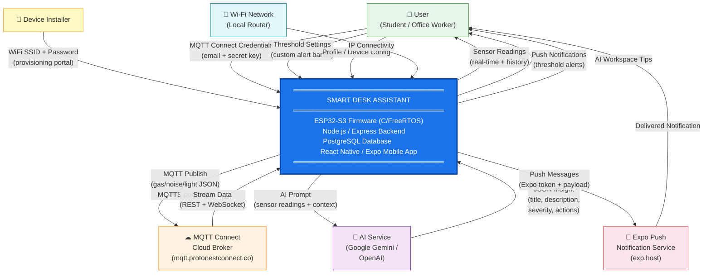
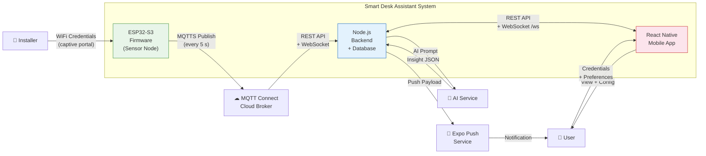

# 04 — Context Diagram
## Smart Desk Assistant (SDA)

### Purpose
The context diagram defines the **system boundary** of the Smart Desk Assistant and shows all external entities that send data to or receive data from the system. It answers the question: *"What is inside the system, what is outside, and how do they communicate?"*

---

### Level 0 Context Diagram (System as a Black Box)



---

### Level 1 Context Diagram (System Decomposed into Subsystems)



---

### External Entity Descriptions

| External Entity | Direction | Data Exchanged | Protocol / Format |
|---|---|---|---|
| **User (Student / Office Worker)** | Bidirectional | Views readings, receives alerts, configures thresholds and MQTT Connect credentials | HTTPS REST, WebSocket, Push Notification |
| **Device Installer** | Inbound | Provides WiFi SSID and password via provisioning portal | HTTP form (application/x-www-form-urlencoded) |
| **MQTT Connect Cloud Broker** | Bidirectional | Firmware publishes sensor JSON; backend fetches historical stream and receives real-time WebSocket stream | MQTTS (TLS, port 8883), HTTPS REST, WSS |
| **Google Gemini / OpenAI** | Bidirectional | Backend sends sensor context prompt; AI returns structured JSON insight | HTTPS REST, `application/json` |
| **Expo Push Notification Service** | Outbound | Backend sends push message objects with Expo tokens | HTTPS POST to `exp.host/--/api/v2/push/send` |
| **Wi-Fi Network** | Inbound | Provides IP connectivity to ESP32-S3 | IEEE 802.11 b/g/n |

---

### Data Dictionary for Context Boundary Flows

#### Firmware → MQTT Connect (Outbound)
```json
Topic:   protonest/<device_client_id>/stream/gas
Payload: {"value": 125.50, "unit": "ppm"}
Rate:    Every 5 seconds per sensor (gas, noise, light)
```

#### MQTT Connect → Backend REST (Inbound)
```json
GET /get-stream-data/device
Body: { "deviceId": "...", "startTime": "ISO8601", "endTime": "ISO8601" }
Response: { "status": "ok", "data": [{ "topicSuffix": "gas", "payload": "...", "timestamp": "..." }] }
```

#### AI Service → Backend (Inbound)
```json
{
  "title": "Open a window to refresh air quality",
  "description": "Your AQI has risen to 145 over the past 30 minutes. ...",
  "severity": "warning",
  "actions": ["Open a window", "Take a 5-minute break outside", "Check ventilation"]
}
```

#### Backend → Mobile App via WebSocket (Outbound)
```json
{
  "type": "sensor_reading",
  "deviceId": "uuid",
  "data": { "airQuality": 145, "lightLevel": 210, "noiseLevel": 58 },
  "timestamp": "2026-03-24T10:00:00.000Z",
  "sourceTimestamp": "2026-03-24T09:59:55.000Z"
}
```

#### Backend → Expo Push (Outbound)
```json
{
  "to": "ExponentPushToken[xxxxx]",
  "sound": "default",
  "title": "High Noise Level Alert",
  "body": "Noise at 72 dB — above your 70 dB threshold.",
  "data": { "type": "threshold_alert", "deviceId": "uuid" },
  "priority": "high"
}
```
