# 05 — Use Case Diagram
## Smart Desk Assistant (SDA)

### Purpose
The use case diagram identifies all **actors** and the **goals** they achieve through the system. It defines the functional scope from the users' perspective rather than the system's internal perspective.

---

### Actors

| Actor | Type | Description |
|---|---|---|
| **Student / Office Worker** | Primary | The main end-user who monitors their workspace environment via the mobile app |
| **Device Installer** | Primary | The person who physically sets up the ESP32-S3 sensor node |
| **System Administrator** | Secondary | Manages backend deployment, database, and environment configuration |
| **MQTT Connect** | External System | Cloud MQTT broker that stores and forwards sensor stream data |
| **AI Service** | External System | Google Gemini or OpenAI GPT-4o-mini that generates workspace insights |
| **Expo Push Service** | External System | Delivers push notifications to the mobile device |

---

### Use Case Diagram

```mermaid
graph TD
    %% Actors
    USER(("👤\nStudent /\nOffice Worker"))
    INSTALLER(("🔧\nDevice\nInstaller"))
    ADMIN(("⚙\nSystem\nAdministrator"))
    MQTT_EXT(("☁\nMQTT Connect\n(External)"))
    AI_EXT(("🤖\nAI Service\n(External)"))
    EXPO_EXT(("📲\nExpo Push\n(External)"))

    subgraph AUTH_UC["Authentication"]
        UC_REG["Register Account"]
        UC_LOGIN["Log In"]
        UC_LOGOUT["Log Out"]
        UC_FORGOT["Reset Password"]
    end

    subgraph DEVICE_UC["Device Management"]
        UC_ADD["Add IoT Device"]
        UC_EDIT["Edit Device Settings"]
        UC_VIEW_DEV["View Device List"]
        UC_DASH["View Real-time Dashboard"]
        UC_PROV["Provision WiFi\n(Hardware Setup)"]
        UC_RESET["Reset WiFi Credentials\n(Button Hold 5s)"]
    end

    subgraph MONITOR_UC["Environment Monitoring"]
        UC_RT["View Real-time\nSensor Readings"]
        UC_HIST["View Historical\nCharts & Reports"]
        UC_COND["View Room\nCondition Score"]
        UC_DETAIL["View Report Details"]
    end

    subgraph INSIGHT_UC["Insights & Alerts"]
        UC_THRESH_INS["Receive Threshold\nAlerts (Push)"]
        UC_AI_INS["Request AI\nWorkspace Insight"]
        UC_VIEW_INS["View All Insights"]
        UC_INS_DETAIL["View Insight Detail\n& Actions"]
    end

    subgraph CONFIG_UC["Configuration"]
        UC_THRESH["Configure Sensor\nThresholds"]
        UC_MQTT_CRED["Set Up MQTT Connect\nCredentials"]
        UC_PROFILE["Edit User Profile"]
        UC_SETTINGS["Configure App\nSettings (Theme / Units)"]
        UC_PUSH_REG["Register Push\nNotification Token"]
    end

    subgraph SYNC_UC["Data Synchronisation"]
        UC_SYNC["Sync Sensor Data\nfrom MQTT Connect"]
        UC_WS_STREAM["Receive Real-time\nMQTT Stream"]
    end

    subgraph ADMIN_UC["Administration"]
        UC_DEPLOY["Deploy Backend\n(Docker)"]
        UC_DB["Manage Database\nSchema & Backups"]
        UC_ENV["Configure Environment\nVariables"]
    end

    %% Actor → Use Case connections
    USER --> UC_REG
    USER --> UC_LOGIN
    USER --> UC_LOGOUT
    USER --> UC_FORGOT
    USER --> UC_ADD
    USER --> UC_EDIT
    USER --> UC_VIEW_DEV
    USER --> UC_DASH
    USER --> UC_RT
    USER --> UC_HIST
    USER --> UC_COND
    USER --> UC_DETAIL
    USER --> UC_THRESH_INS
    USER --> UC_AI_INS
    USER --> UC_VIEW_INS
    USER --> UC_INS_DETAIL
    USER --> UC_THRESH
    USER --> UC_MQTT_CRED
    USER --> UC_PROFILE
    USER --> UC_SETTINGS
    USER --> UC_PUSH_REG

    INSTALLER --> UC_PROV
    INSTALLER --> UC_RESET

    ADMIN --> UC_DEPLOY
    ADMIN --> UC_DB
    ADMIN --> UC_ENV

    MQTT_EXT --> UC_SYNC
    MQTT_EXT --> UC_WS_STREAM

    AI_EXT --> UC_AI_INS
    EXPO_EXT --> UC_THRESH_INS
    EXPO_EXT --> UC_PUSH_REG

    style USER fill:#e8f5e9,stroke:#388e3c
    style INSTALLER fill:#fff9c4,stroke:#f9a825
    style ADMIN fill:#e3f2fd,stroke:#1565c0
    style MQTT_EXT fill:#fff3e0,stroke:#f57c00
    style AI_EXT fill:#f3e5f5,stroke:#6a1b9a
    style EXPO_EXT fill:#fce4ec,stroke:#c62828
```

---

### Detailed Use Case Descriptions

#### UC-01: Register Account
- **Actor:** Student / Office Worker
- **Precondition:** User has the mobile app installed
- **Main Flow:** User enters full name, email, password → Backend validates → Creates user + default settings + default thresholds → Returns JWT tokens → User logged in
- **Alternate Flow:** Email already exists → Error returned
- **Postcondition:** User account created; JWT stored in app

---

#### UC-02: Provision WiFi (Hardware Setup)
- **Actor:** Device Installer
- **Precondition:** ESP32-S3 has no stored WiFi credentials (first boot or after reset)
- **Main Flow:** ESP32-S3 boots → No NVS credentials → Starts AP "ESP32S3-Setup" → Installer connects phone to AP → Opens http://192.168.4.1 → Enters SSID + password → Submits form → Firmware saves to NVS → Restarts → Connects to router
- **Alternate Flow:** SSID field empty → Error page returned
- **Postcondition:** Firmware connects to router and begins MQTT publishing

---

#### UC-03: View Real-time Dashboard
- **Actor:** Student / Office Worker
- **Precondition:** User logged in; at least one device registered with MQTT Connect Device ID
- **Main Flow:** User navigates to Devices → selects device → Dashboard screen → WebSocket connection opens → Backend sends cached snapshot → Live updates appear as MQTT data arrives → Sensor gauges update in real time
- **Alternate Flow:** Device offline → Dashboard shows last known values with "offline" badge
- **Postcondition:** User sees live AQI, noise, light, temperature, humidity readings

---

#### UC-04: Set Up MQTT Connect Credentials
- **Actor:** Student / Office Worker
- **Precondition:** User has an account on the MQTT Connect platform
- **Main Flow:** User navigates to Profile → MQTT Connect → Enters MQTT Connect email and password → Taps Save & Verify → Backend calls MQTT Connect `/get-token` → On success stores encrypted credentials → Connected status shown
- **Postcondition:** Backend sync service starts polling MQTT Connect for this user's devices

---

#### UC-05: Configure Sensor Thresholds
- **Actor:** Student / Office Worker
- **Precondition:** User logged in
- **Main Flow:** User navigates to Profile → Sensor Thresholds → Edits bands for AQI / light / noise / temperature / humidity → Saves → Backend stores per-user thresholds → All future insight generation uses new bands
- **Postcondition:** Custom thresholds stored; threshold engine uses updated values

---

#### UC-06: Request AI Workspace Insight
- **Actor:** Student / Office Worker
- **Precondition:** Device has at least one sensor reading; AI_API_KEY configured on backend
- **Main Flow:** User taps "Get AI Insight" in Insights screen → Backend checks 2-hour cooldown → If expired: fetches 10 latest readings → Builds prompt with sensor values + time of day + trends → Calls Gemini/OpenAI → Parses JSON response → Stores insight → Returns to app → App displays title, description, and action list
- **Alternate Flow (cooldown active):** Returns most recent AI insight from database without calling AI
- **Alternate Flow (no API key):** Returns error "AI insights not configured"
- **Postcondition:** AI insight displayed with actionable steps

---

#### UC-07: Receive Threshold Alert
- **Actor:** Student / Office Worker
- **Trigger:** Backend detects sensor reading exceeds user-defined threshold band
- **Main Flow:** Sensor reading arrives → Backend evaluates against user thresholds → Threshold breached → Check notification cooldown (avoid spam) → Send Expo push notification to all registered tokens → Notification delivered to user's device
- **Alternate Flow:** Cooldown active for this device+sensor type → Notification suppressed
- **Postcondition:** User receives push notification with specific condition and recommended action

---

#### UC-08: Sync Sensor Data from MQTT Connect
- **Actor:** MQTT Connect (External System)
- **Trigger:** Backend sync timer fires every 5 seconds
- **Main Flow:** Backend queries `protonest_credentials` table → Gets valid JWT (refresh if needed) → Queries MQTT Connect REST API for stream data since last sync → Groups records into 5-second windows → Deduplicates → Inserts new sensor_readings rows → Updates device status to online → Broadcasts via WebSocket to connected app clients → Generates threshold insights
- **Postcondition:** Database updated; connected app clients see updated readings

---

### Use Case Priority Matrix

| Use Case | Priority | Complexity | Status |
|---|---|---|---|
| Register / Login / Logout | Must Have | Low | Implemented |
| View Real-time Dashboard | Must Have | High | Implemented |
| Receive Push Notifications | Must Have | Medium | Implemented |
| MQTT Connect Setup | Must Have | Medium | Implemented |
| Configure Thresholds | Should Have | Medium | Implemented |
| AI Workspace Insight | Should Have | High | Implemented |
| Historical Reports | Should Have | Medium | Implemented |
| WiFi Provisioning | Must Have | Medium | Implemented |
| Edit Profile | Could Have | Low | Implemented |
| Dark/Light Theme | Could Have | Low | Implemented |
