# 06 — System Architecture Diagram
## Smart Desk Assistant (SDA)

### Purpose
The system architecture diagram shows the **four-layer architecture** of the Smart Desk Assistant: Hardware/Firmware, Cloud MQTT, Backend, and Mobile Application. It illustrates how components are arranged, how layers communicate, and what technologies are used at each level.

---

### High-Level Architecture Overview

```mermaid
graph TB
    subgraph L1["LAYER 1 — HARDWARE (Firmware)"]
        subgraph ESP["ESP32-S3 Sensor Node"]
            GAS_S["Gas Sensor\n(GPIO 4 / ADC1-CH3)\n0–1000 ppm"]
            NOISE_S["Microphone\n(GPIO 5 / ADC1-CH4)\n30–130 dB"]
            LIGHT_S["LDR Light Sensor\n(GPIO 6 / ADC1-CH5)\n0–1000 lux"]
            BTN["Reset Button\n(GPIO 13)\n5s hold to clear WiFi"]
            ADC["ADC1 OneShot\n12-bit, Atten 12dB"]
            FREERTOS["FreeRTOS"]
            RTOS_BTN["button_task\n(100 ms poll)"]
            RTOS_PUB["publish_task\n(5 s interval)"]
            MQTT_CLI["ESP-MQTT Client\n(TLS)"]
            NVS_STORE["NVS Flash\n(WiFi Credentials)"]
            PROV_AP["Provisioning AP\n(ESP32S3-Setup)\n192.168.4.1"]
        end
    end

    subgraph L2["LAYER 2 — MQTT CONNECT CLOUD"]
        BROKER["MQTT Broker\nmqtt.protonestconnect.co:8883\n(TLS / MQTTS)"]
        REST_API["REST API\napi.protonestconnect.co/api/v1/user"]
        WS_API["WebSocket API\nwss://api.protonestconnect.co/ws"]
        CLOUD_DB["Cloud Storage\n(Stream Records\n+ State Records)"]
    end

    subgraph L3["LAYER 3 — BACKEND SERVER"]
        subgraph EXPRESS_APP["Express.js Application (TypeScript)"]
            AUTH_MW["JWT Auth Middleware"]
            RATE_LIM["Rate Limiter"]
            ROUTES["API Routes\n/auth /devices /insights\n/user /ingest\n/mqtt-connect /thresholds"]
        end
        subgraph SERVICES["Backend Services"]
            SYNC_SVC["MQTT Connect\nSync Service\n(5 s REST poll)"]
            WS_SVC["WebSocket Service\n(/ws — app + MQTT Connect)"]
            AI_SVC["AI Insights Service\n(Gemini / OpenAI)"]
            INS_GEN["Insight Generator\n(threshold rules)"]
            PUSH_SVC["Push Notification\nService (Expo)"]
            RT_SVC["Realtime Sensor\nService (cache)"]
        end
        PG[("PostgreSQL\nDatabase")]
    end

    subgraph L4["LAYER 4 — MOBILE APPLICATION"]
        subgraph RN["React Native / Expo (TypeScript)"]
            NAV["React Navigation\n(Stack + Bottom Tab)"]
            CONTEXTS["Context Providers\nAuth / Theme / Devices / Realtime"]
            SCREENS_AUTH["Auth Screens\nSplash / Login / Register"]
            SCREENS_DEV["Devices Screens\nList / Dashboard / Add-Edit"]
            SCREENS_RPT["Reports Screens\nReports / Report Details"]
            SCREENS_INS["Insights Screens\nInsights / Insight Details"]
            SCREENS_PRF["Profile Screens\nProfile / Settings /\nMQTT Connect / Thresholds"]
            API_SVC["API Client\n(HTTPS + WebSocket)"]
            PUSH_HOOK["usePushNotifications\n(Expo Push Registration)"]
            RT_HOOK["useRealtimeReadings\n(WebSocket consumer)"]
        end
    end

    %% ─── Data flow between layers ─────────────────────────────
    GAS_S --> ADC
    NOISE_S --> ADC
    LIGHT_S --> ADC
    ADC --> RTOS_PUB
    BTN --> RTOS_BTN
    RTOS_BTN --> NVS_STORE
    FREERTOS --> RTOS_BTN
    FREERTOS --> RTOS_PUB
    RTOS_PUB --> MQTT_CLI
    NVS_STORE --> PROV_AP

    MQTT_CLI -- "MQTTS\nport 8883\nJSON payload" --> BROKER
    BROKER --> CLOUD_DB
    BROKER --> WS_API
    REST_API --> CLOUD_DB

    SYNC_SVC -- "REST GET\nstream data" --> REST_API
    WS_SVC -- "WSS subscribe\ntopic/stream/<id>" --> WS_API
    SYNC_SVC --> PG
    WS_SVC --> PG
    WS_SVC --> RT_SVC
    SYNC_SVC --> RT_SVC
    RT_SVC --> PUSH_SVC
    RT_SVC --> INS_GEN
    INS_GEN --> PG
    AI_SVC --> PG
    ROUTES --> PG
    ROUTES --> AI_SVC
    AUTH_MW --> ROUTES
    RATE_LIM --> ROUTES

    WS_SVC -- "WebSocket\n/ws" --> RT_HOOK
    ROUTES -- "REST API\nHTTPS" --> API_SVC
    PUSH_SVC -- "Expo Push\nAPI" --> PUSH_HOOK

    API_SVC --> SCREENS_AUTH
    API_SVC --> SCREENS_DEV
    API_SVC --> SCREENS_RPT
    API_SVC --> SCREENS_INS
    API_SVC --> SCREENS_PRF
    RT_HOOK --> CONTEXTS
    CONTEXTS --> SCREENS_DEV
    NAV --> SCREENS_AUTH
    NAV --> SCREENS_DEV
    NAV --> SCREENS_RPT
    NAV --> SCREENS_INS
    NAV --> SCREENS_PRF

    style L1 fill:#e8f5e9,stroke:#388e3c,stroke-width:2px
    style L2 fill:#fff3e0,stroke:#f57c00,stroke-width:2px
    style L3 fill:#e3f2fd,stroke:#1565c0,stroke-width:2px
    style L4 fill:#fce4ec,stroke:#c62828,stroke-width:2px
```

---

### Component Responsibilities

#### Layer 1 — Hardware / Firmware

| Component | Responsibility |
|---|---|
| **ESP32-S3 MCU** | Dual-core Xtensa LX7 microcontroller running FreeRTOS; manages all peripheral I/O |
| **ADC1 OneShot** | Reads raw 12-bit voltage from three analog sensors; applies 12 dB attenuation |
| **Gas Sensor (GPIO 4)** | Measures air quality / volatile gas concentration; mapped linearly to 0–1000 ppm |
| **Microphone (GPIO 5)** | Measures ambient sound pressure; mapped linearly to 30–130 dB |
| **LDR (GPIO 6)** | Measures ambient illuminance; mapped linearly to 0–1000 lux |
| **button_task** | Polls GPIO 13 every 100 ms; 5-second hold triggers NVS erase and reboot |
| **publish_task** | Reads all three sensors every 5 s and publishes JSON over TLS MQTT |
| **ESP-MQTT Client** | Handles TLS handshake with root CA certificate, MQTT connection, and publish |
| **NVS Flash** | Non-volatile storage for WiFi SSID and password; survives power cycles |
| **Provisioning AP** | Starts open-access-point "ESP32S3-Setup" when no credentials found; serves HTTP portal |

---

#### Layer 2 — MQTT Connect Cloud

| Component | Responsibility |
|---|---|
| **MQTT Broker** | Receives MQTT PUBLISH packets from ESP32-S3 over MQTTS (TLS port 8883); stores stream records |
| **REST API** | Provides JWT token acquisition, historical stream data retrieval, and device state endpoints |
| **WebSocket API** | Pushes real-time stream records to subscribed backend WebSocket clients |
| **Cloud Storage** | Persists all sensor stream records and device state; accessible via REST and WebSocket |

---

#### Layer 3 — Backend Server

| Component | Responsibility |
|---|---|
| **Express.js** | HTTP server; routes, middleware (helmet, CORS, Morgan, rate limiter) |
| **JWT Auth Middleware** | Validates Bearer tokens on protected routes; extracts userId from payload |
| **API Routes (7 groups)** | RESTful endpoints for auth, devices, insights, user, ingest, MQTT Connect, thresholds |
| **MQTT Connect Sync Service** | Polls MQTT Connect REST every 5 s; groups records into 5 s windows; deduplicates; persists |
| **WebSocket Service** | Manages app client WebSocket connections; opens per-user MQTT Connect WebSocket; bridges real-time data |
| **AI Insights Service** | Calls Gemini or OpenAI with sensor context prompt; rate-limited by 2-hour cooldown |
| **Insight Generator** | Evaluates latest readings against user thresholds; creates info/warning/critical insights |
| **Push Notification Service** | Checks threshold alerts with cooldown; sends Expo push messages |
| **Realtime Sensor Service** | Maintains in-memory snapshot cache per device; merges partial sensor patches |
| **PostgreSQL** | Stores all persistent data: users, devices, readings, insights, credentials, thresholds |

---

#### Layer 4 — Mobile Application

| Component | Responsibility |
|---|---|
| **React Navigation** | Stack + Bottom Tab navigator; hides tab bar on drill-down screens |
| **AuthContext** | Holds user object and JWT; gates authenticated vs. unauthenticated navigation |
| **ThemeContext** | Provides light/dark color scheme; persists choice |
| **DevicesContext** | Manages device list state; exposes CRUD operations |
| **RealtimeContext** | Holds live sensor reading state; updated by WebSocket messages |
| **Devices / Dashboard** | Displays sensor gauges, device status, room condition score in real time |
| **Reports** | Shows historical sensor charts; filterable by time range |
| **Insights** | Lists threshold and AI insights; allows manual AI refresh |
| **Profile / MQTT Connect** | Allows credentials entry, connection test, and sync trigger for MQTT Connect |
| **Threshold Settings** | Lets users customise all sensor alert bands with offset calibration |
| **usePushNotifications** | Registers device for Expo push notifications on app launch |
| **useRealtimeReadings** | Opens WebSocket to backend; dispatches incoming sensor patches to RealtimeContext |

---

### Communication Protocols Summary

| From | To | Protocol | Port | Format |
|---|---|---|---|---|
| ESP32-S3 | MQTT Connect Broker | MQTTS (MQTT over TLS) | 8883 | JSON `{"value":X,"unit":"Y"}` |
| Backend | MQTT Connect REST | HTTPS | 443 | JSON |
| Backend | MQTT Connect WebSocket | WSS | 443 | JSON stream |
| Mobile App | Backend REST | HTTPS | 3000 | JSON |
| Mobile App | Backend WebSocket | WS | 3000 | JSON |
| Backend | Expo Push Service | HTTPS | 443 | JSON |
| Backend | Gemini / OpenAI | HTTPS | 443 | JSON |
