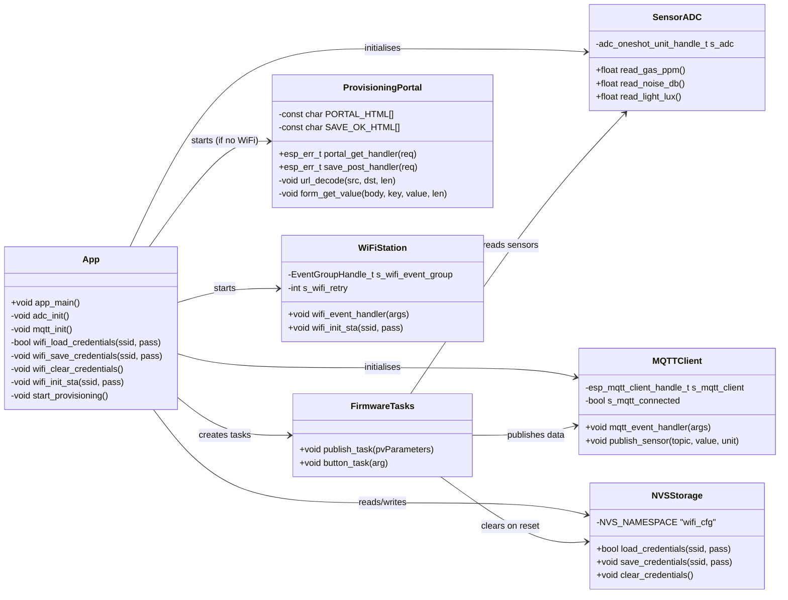

# 07 — Class Diagram
## Smart Desk Assistant (SDA)

### Purpose
The class diagram presents the **domain model** of the Smart Desk Assistant at the data and behaviour level. It covers the backend TypeScript types and service classes, and the corresponding database schema entities.

---

### Core Domain Class Diagram

```mermaid
classDiagram
    direction TB

    %% ─── Domain Entities ─────────────────────────────────────────

    class User {
        +String id
        +String email
        +String password_hash
        +String full_name
        +String phone_number
        +String timezone
        +String avatar
        +Date created_at
        +Date updated_at
    }

    class UserSettings {
        +String id
        +String user_id
        +String theme
        +String units
        +Boolean notifications_enabled
        +Boolean data_privacy_analytics
        +Date created_at
        +Date updated_at
    }

    class Device {
        +String id
        +String user_id
        +String name
        +DeviceType type
        +String location
        +DeviceStatus status
        +Number battery_level
        +String device_key
        +String mqtt_connect_device_id
        +String wifi_ssid
        +Boolean wifi_auto_connect
        +Boolean notification_threshold_alerts
        +Boolean notification_daily_summary
        +Boolean notification_weekly_report
        +Boolean notification_device_offline
        +Date created_at
        +Date updated_at
        +SensorReading lastReading
    }

    class SensorReading {
        +String id
        +String device_id
        +Date timestamp
        +Number air_quality
        +Number light_level
        +Number noise_level
        +Number temperature
        +Number humidity
    }

    class Insight {
        +String id
        +String device_id
        +InsightType type
        +String title
        +String description
        +InsightSeverity severity
        +Boolean actionable
        +String[] actions
        +Date timestamp
        +String source
    }

    class Session {
        +String id
        +String user_id
        +String refresh_token
        +Date expires_at
        +Date created_at
    }

    class MQTTConnectCredentials {
        +String id
        +String user_id
        +String mqtt_connect_email
        +String mqtt_connect_secret_key
        +String jwt_token
        +String refresh_token
        +Date jwt_expires_at
        +Date created_at
        +Date updated_at
        +Boolean connected
        +String email
    }

    class SensorThresholds {
        +String id
        +String user_id
        +Number aqi_excellent_max
        +Number aqi_good_max
        +Number aqi_moderate_max
        +Number light_low_min
        +Number light_good_min
        +Number light_good_max
        +Number light_bright_max
        +Number noise_quiet_max
        +Number noise_moderate_max
        +Number noise_loud_max
        +Number temp_cold_max
        +Number temp_good_min
        +Number temp_good_max
        +Number temp_hot_min
        +Number humidity_dry_max
        +Number humidity_good_min
        +Number humidity_good_max
        +Number humidity_wet_min
        +Number offset_air_quality
        +Number offset_light_level
        +Number offset_noise_level
        +Number offset_temperature
        +Number offset_humidity
    }

    class PushToken {
        +String id
        +String user_id
        +String expo_push_token
        +String device_name
        +Date created_at
    }

    class NotificationLog {
        +String id
        +String user_id
        +String device_id
        +String sensor_type
        +String title
        +String body
        +Date sent_at
    }

    class RoomCondition {
        +Number score
        +String label
        +String color
        +ConditionBreakdown breakdown
        +computeScore(reading, thresholds) RoomCondition$
    }

    class ConditionBreakdown {
        +ConditionMetric airQuality
        +ConditionMetric lightLevel
        +ConditionMetric noiseLevel
        +ConditionMetric temperature
        +ConditionMetric humidity
    }

    class ConditionMetric {
        +Number score
        +String label
        +String color
    }

    %% ─── Service Classes ──────────────────────────────────────────

    class MQTTConnectSyncService {
        -String ENCRYPTION_KEY
        -NodeJS.Timeout syncInterval
        +encryptSecret(plaintext) String$
        +decryptSecret(ciphertext) String$
        +startSyncService(intervalMs, broadcaster) void$
        +stopSyncService() void$
        +runSyncForUser(userId, broadcaster) Promise~void~$
        -syncDeviceData(jwt, deviceId, mqttDeviceId) Promise~void~$
        -ensureValidToken(cred) Promise~String~$
        -getTopicMapping() Record~String,String~$
    }

    class WebSocketService {
        -WebSocketServer wss
        -Map clientsByUser
        -Map mqttConnectHealth
        +initWebSocketServer(server) void$
        +broadcastSensorReading(userId, deviceId, reading) void$
        -connectMQTTConnectForUser(userId) Promise~void~$
        -disconnectMQTTConnectForUser(userId) void$
        -broadcastToUser(userId, deviceId, reading) void$
        -sendCachedSnapshotsToClient(ws) void$
        -checkExistingReadingsForAlerts(userId, deviceIds) Promise~void~$
    }

    class AIInsightsService {
        -String AI_PROVIDER
        -String AI_API_KEY
        -Number AI_INTERVAL_HOURS
        +generateAIInsight(deviceId, forceRefresh) Promise~Insight~$
        -callGemini(prompt) Promise~Object~$
        -callOpenAI(prompt) Promise~Object~$
        -buildPrompt(device, readings) String$
    }

    class InsightGenerator {
        +generateAutoInsights(deviceId, airQuality, lightLevel, noiseLevel) Promise~void~$
        -evaluateAQI(value, thresholds) InsightSeverity$
        -evaluateLight(value, thresholds) InsightSeverity$
        -evaluateNoise(value, thresholds) InsightSeverity$
    }

    class PushNotificationService {
        +checkAndNotify(userId, deviceId, deviceName, reading) Promise~void~$
        -isOnCooldown(userId, deviceId, sensorType) Promise~Boolean~$
        -sendExpoPush(tokens, title, body, data) Promise~void~$
        -logNotification(userId, deviceId, sensorType, title, body) Promise~void~$
    }

    class RealtimeSensorService {
        -Map snapshotCache
        +publishRealtimeUpdate(params, broadcaster) Object$
        +getCachedRealtimeSnapshotsForUser(userId, deviceIds) Array$
        -mergeSnapshot(existing, patch) RealtimeReading$
    }

    class MQTTConnectClient {
        +getToken(email, password) Promise~TokenResponse~$
        +renewToken(refreshToken) Promise~TokenResponse~$
        +getStreamDataByDevice(jwt, deviceId, start, end) Promise~StreamDataResponse~$
        +getStreamDataByDeviceTopic(jwt, deviceId, topic) Promise~StreamDataResponse~$
        +getStateDetails(jwt, deviceId) Promise~StateResponse~$
        +getStateByTopic(jwt, deviceId, topic) Promise~StateResponse~$
    }

    %% ─── Enumerations ─────────────────────────────────────────────

    class DeviceType {
        <<enumeration>>
        air_quality
        light_sensor
        noise_meter
        multi_sensor
    }

    class DeviceStatus {
        <<enumeration>>
        online
        offline
        connecting
        error
    }

    class InsightType {
        <<enumeration>>
        air_quality
        lighting
        noise
        productivity
        health
        ai_recommendation
    }

    class InsightSeverity {
        <<enumeration>>
        info
        warning
        critical
    }

    class InsightSource {
        <<enumeration>>
        threshold
        ai
    }

    %% ─── Relationships ────────────────────────────────────────────

    User "1" --> "1" UserSettings : has
    User "1" --> "0..*" Device : owns
    User "1" --> "0..*" Session : authenticates via
    User "1" --> "0..1" MQTTConnectCredentials : connects via
    User "1" --> "1" SensorThresholds : configures
    User "1" --> "0..*" PushToken : registers

    Device "1" --> "0..*" SensorReading : generates
    Device "1" --> "0..*" Insight : has
    Device "1" --> "0..*" NotificationLog : logs
    Device --> DeviceType : typed as
    Device --> DeviceStatus : has status

    Insight --> InsightType : categorised as
    Insight --> InsightSeverity : rated as
    Insight --> InsightSource : generated by

    RoomCondition --> ConditionBreakdown : contains
    ConditionBreakdown --> ConditionMetric : has 5

    MQTTConnectSyncService ..> MQTTConnectCredentials : reads
    MQTTConnectSyncService ..> SensorReading : writes
    MQTTConnectSyncService ..> Device : updates status
    MQTTConnectSyncService ..> MQTTConnectClient : calls

    WebSocketService ..> MQTTConnectCredentials : reads
    WebSocketService ..> MQTTConnectClient : calls
    WebSocketService ..> RealtimeSensorService : uses
    WebSocketService ..> PushNotificationService : triggers

    AIInsightsService ..> Insight : creates
    AIInsightsService ..> SensorReading : reads

    InsightGenerator ..> Insight : creates
    InsightGenerator ..> SensorThresholds : reads

    PushNotificationService ..> PushToken : reads
    PushNotificationService ..> NotificationLog : writes

    RealtimeSensorService ..> SensorReading : persists
```

---

### Firmware Class Model (C / FreeRTOS)

---

### Key Design Decisions

| Decision | Rationale |
|---|---|
| **Per-user SensorThresholds** | Allows each user to calibrate alert bands to their personal health preferences and office environment |
| **Encrypted MQTT Connect secret key** | AES-256-CBC encryption with random IV stored alongside ciphertext; raw passwords never persisted |
| **Realtime snapshot cache (in-memory)** | New WebSocket clients receive last-known readings immediately without a database query |
| **InsightSource enum (threshold vs. ai)** | Allows filtering and display of rule-based vs. AI-generated insights separately in the UI |
| **5-second window grouping in sync** | Merges gas/noise/light readings that arrive within the same 5 s publish interval into a single sensor_readings row |
| **Two-hour AI insight cooldown** | Prevents excessive AI API spending while still providing periodic fresh recommendations |
