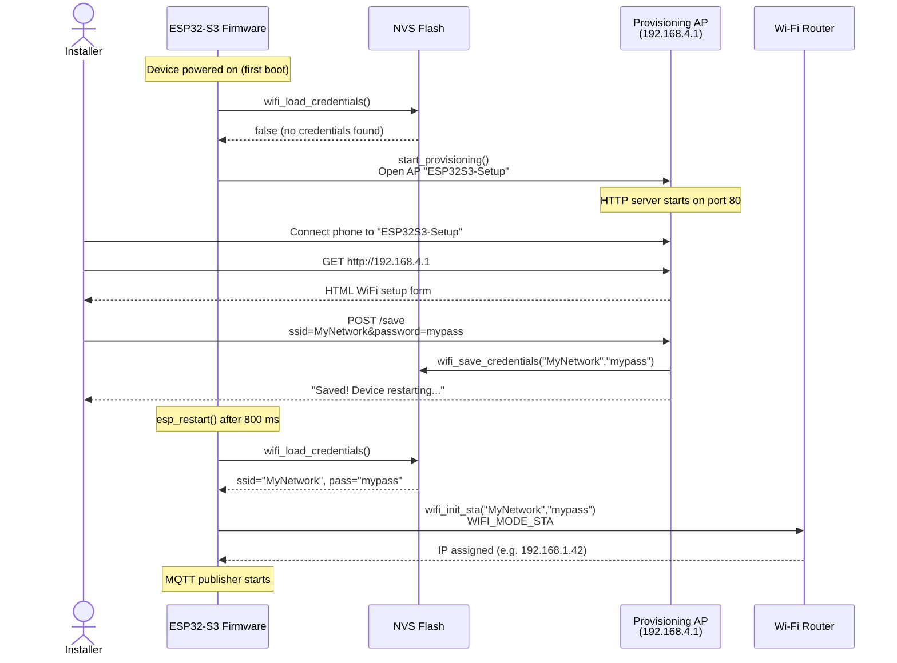
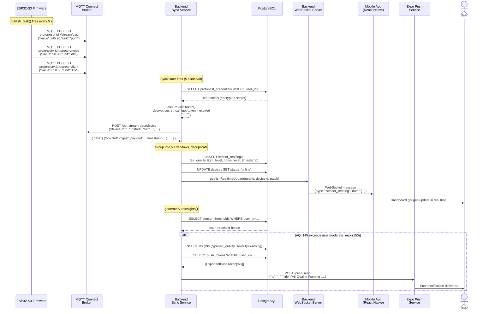
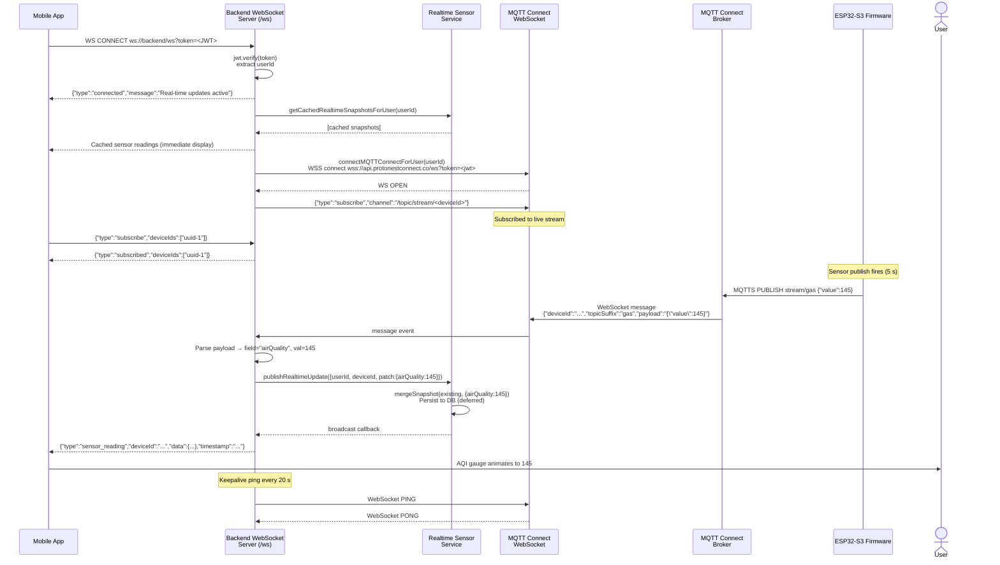
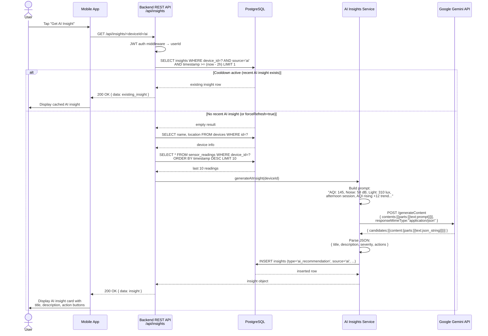
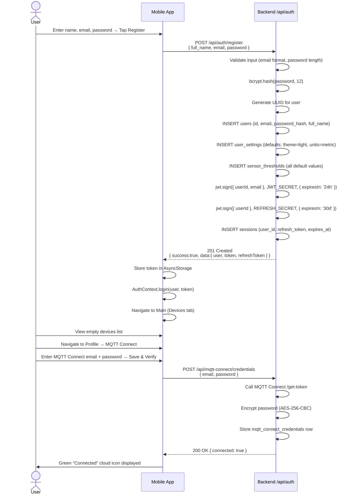

# 08 — Sequence Diagram
## Smart Desk Assistant (SDA)

### Purpose
Sequence diagrams show **how objects interact over time** in a specific scenario. They make explicit the order of messages, the components involved, and the data exchanged. Four key scenarios are documented below.

---

## Sequence 1: Device First-Time WiFi Provisioning

**Scenario:** An installer sets up a new ESP32-S3 sensor node for the first time.

---

## Sequence 2: Sensor Data — Full End-to-End Flow (REST Sync Path)

**Scenario:** ESP32-S3 publishes sensor data; backend syncs via REST polling and distributes to mobile app.

---

## Sequence 3: Real-Time WebSocket Path (Live Sensor Updates)

**Scenario:** Mobile app connects via WebSocket; sensor data arrives in real time via MQTT Connect WebSocket bridge.

---

## Sequence 4: AI Workspace Insight Generation

**Scenario:** User taps "Get AI Insight" in the Insights screen.

---

## Sequence 5: User Registration and First Login

