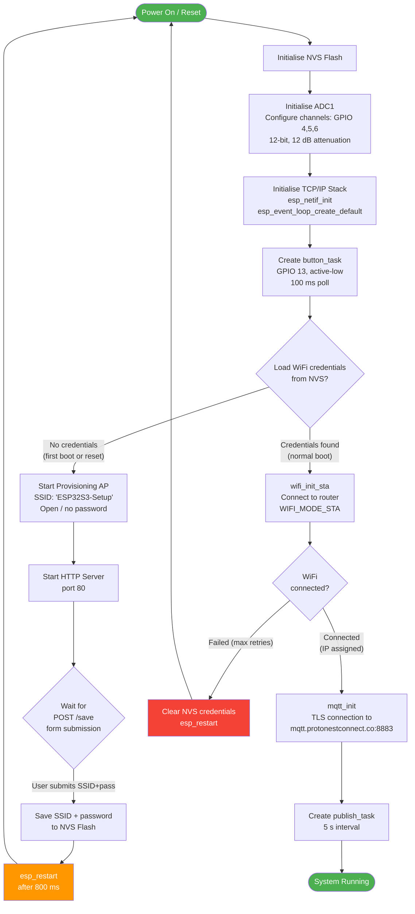
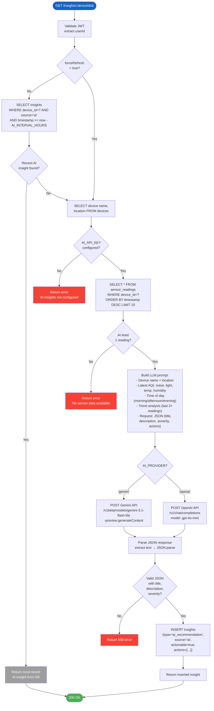

# 09 — Algorithm Diagram
## Smart Desk Assistant (SDA)

### Purpose
Algorithm diagrams (expressed as flowcharts) show the **step-by-step logical procedures** within key system functions. They are essential for understanding decision points, loops, and branching behaviour in the firmware and backend services.

---

## Algorithm 1: ESP32-S3 Boot and Startup



---

## Algorithm 2: Sensor Read and MQTT Publish (publish_task)

```mermaid
flowchart TD
    INIT([publish_task starts]) --> WAIT_CONN{s_mqtt_connected?}
    WAIT_CONN -- No --> DELAY1[vTaskDelay 500 ms] --> WAIT_CONN
    WAIT_CONN -- Yes --> LOOP_START

    LOOP_START([Enter publish loop])

    LOOP_START --> CHECK_CONN{s_mqtt_connected?}

    CHECK_CONN -- Yes --> READ_GAS[adc_oneshot_read\nGAS_ADC_CH\nraw 0–4095]
    READ_GAS --> CALC_GAS["gas_ppm = (raw / 4095) × 1000"]
    CALC_GAS --> READ_NOISE[adc_oneshot_read\nNOISE_ADC_CH]
    READ_NOISE --> CALC_NOISE["noise_dB = 30 + (raw / 4095) × 100"]
    CALC_NOISE --> READ_LIGHT[adc_oneshot_read\nLIGHT_ADC_CH]
    READ_LIGHT --> CALC_LIGHT["light_lux = (raw / 4095) × 1000"]

    CALC_LIGHT --> PUB_GAS["esp_mqtt_client_publish\ntopic: protonest/<id>/stream/gas\npayload: {\"value\":X.XX,\"unit\":\"ppm\"}"]
    PUB_GAS --> PUB_NOISE["esp_mqtt_client_publish\ntopic: protonest/<id>/stream/noise\npayload: {\"value\":X.XX,\"unit\":\"dB\"}"]
    PUB_NOISE --> PUB_LIGHT["esp_mqtt_client_publish\ntopic: protonest/<id>/stream/light\npayload: {\"value\":X.XX,\"unit\":\"lux\"}"]

    CHECK_CONN -- No --> LOG_SKIP[ESP_LOGW: skipping publish\n(MQTT not connected)]

    PUB_LIGHT --> DELAY2[vTaskDelay 5000 ms]
    LOG_SKIP --> DELAY2
    DELAY2 --> LOOP_START

    style INIT fill:#1565c0,color:#fff
    style LOOP_START fill:#42a5f5,color:#000
```

---

## Algorithm 3: Button Reset Logic (button_task)

```mermaid
flowchart TD
    START([button_task starts]) --> CONFIG[Configure GPIO 13\nMode: INPUT\nPull-up: ENABLED\nInterrupt: DISABLED]

    CONFIG --> LOOP([Poll loop — every 100 ms])
    LOOP --> READ_BTN{gpio_get_level\nGPIO 13 == 0?\n(active-low pressed)}

    READ_BTN -- Button not pressed --> RESET_HOLD[hold_counter = 0]
    RESET_HOLD --> DELAY[vTaskDelay 100 ms]
    DELAY --> LOOP

    READ_BTN -- Button pressed --> INC[hold_counter++]
    INC --> REACHED{hold_counter ≥\n50 ticks?\n(5 seconds × 10 ticks/s)}

    REACHED -- No --> DELAY2[vTaskDelay 100 ms]
    DELAY2 --> LOOP

    REACHED -- Yes --> CLEAR[wifi_clear_credentials\nErase NVS namespace]
    CLEAR --> RESTART_BTN[vTaskDelay 200 ms\nesp_restart]
    RESTART_BTN --> REBOOT([Device Reboots\nLaunches provisioning portal])

    style START fill:#1565c0,color:#fff
    style REBOOT fill:#ff9800,color:#fff
```

---

## Algorithm 4: MQTT Connect Sync Service (Backend)

```mermaid
flowchart TD
    TIMER([Sync timer fires\nevery 5 seconds]) --> QUERY_USERS[SELECT DISTINCT user_id\nFROM mqtt_connect_credentials]

    QUERY_USERS --> FOR_EACH{For each user\nwith credentials}
    FOR_EACH -- More users --> GET_CRED[Fetch credentials row\nfor this user_id]

    GET_CRED --> TOKEN_CHECK{JWT token valid?\nexpires_at - now > 5 min}

    TOKEN_CHECK -- Valid --> USE_JWT[Use existing JWT]
    TOKEN_CHECK -- Expired or missing --> TRY_REFRESH{Refresh token\navailable?}

    TRY_REFRESH -- Yes --> CALL_REFRESH[Call MQTT Connect\n/get-new-token\nwith X-Refresh-Token header]
    CALL_REFRESH --> REFRESH_OK{Refresh\nsucceeded?}
    REFRESH_OK -- Yes --> STORE_JWT[Update jwt_token,\nrefresh_token,\njwt_expires_at in DB]
    STORE_JWT --> USE_JWT

    REFRESH_OK -- No --> RE_AUTH[Decrypt secret key\nCall /get-token\nwith email + password]
    TRY_REFRESH -- No --> RE_AUTH
    RE_AUTH --> STORE_JWT

    USE_JWT --> GET_DEVICES[SELECT devices\nWHERE user_id = ?\nAND mqtt_connect_device_id IS NOT NULL]

    GET_DEVICES --> FOR_DEVICE{For each device}
    FOR_DEVICE -- More devices --> LAST_TS[SELECT MAX timestamp\nFROM sensor_readings\nWHERE device_id = ?]

    LAST_TS --> CALL_STREAM[Call MQTT Connect\n/get-stream-data/device\nstartTime = last_ts or -1 hour]

    CALL_STREAM --> GOT_DATA{Records\nreturned?}
    GOT_DATA -- No data --> NEXT_DEVICE[Log: no new data\nfor device]

    GOT_DATA -- Records found --> GROUP[Group by 5-second\ntime window\n(round ts to nearest 5 s)]

    GROUP --> FOR_WINDOW{For each\ntime window}
    FOR_WINDOW -- More windows --> PARSE[Parse topicSuffix →\ncolumn mapping\ngas→air_quality\nnoise→noise_level\nlight→light_level]

    PARSE --> EXTRACT[Extract numeric value\nfrom payload JSON]
    EXTRACT --> DEDUP{Row already\nexists in DB for\nthis device+timestamp?}
    DEDUP -- Duplicate --> SKIP[Skip window]
    SKIP --> FOR_WINDOW

    DEDUP -- New data --> INSERT[INSERT sensor_readings\n(air_quality, light_level,\nnoise_level, timestamp)]
    INSERT --> SET_ONLINE[UPDATE devices\nSET status = 'online']
    SET_ONLINE --> BROADCAST[publishRealtimeUpdate\n→ broadcastSensorReading\nto WebSocket clients]
    BROADCAST --> GEN_INSIGHT[generateAutoInsights\n(threshold evaluation)]
    GEN_INSIGHT --> FOR_WINDOW

    FOR_WINDOW -- Done --> FOR_DEVICE
    NEXT_DEVICE --> FOR_DEVICE
    FOR_DEVICE -- Done --> FOR_EACH
    FOR_EACH -- Done --> TIMER

    style TIMER fill:#1565c0,color:#fff
    style INSERT fill:#4caf50,color:#fff
    style SKIP fill:#9e9e9e,color:#fff
```

---

## Algorithm 5: Threshold-Based Insight Generation

```mermaid
flowchart TD
    START([generateAutoInsights called\ndeviceId, airQuality, lightLevel, noiseLevel]) --> GET_THRESH[SELECT sensor_thresholds\nWHERE user_id = device.user_id\n(use DEFAULT_THRESHOLDS if none)]

    GET_THRESH --> EVAL_AQI{Air Quality\nprovided?}

    EVAL_AQI -- Yes --> AQI_CRITICAL{AQI >\naqi_moderate_max\n(default 150)}
    AQI_CRITICAL -- Yes --> INS_AQI_CRIT["Create Insight\ntype=air_quality\nseverity=critical\n'Dangerous Air Quality'\nActions: ventilate, leave room"]

    AQI_CRITICAL -- No --> AQI_WARN{AQI >\naqi_good_max\n(default 100)}
    AQI_WARN -- Yes --> INS_AQI_WARN["Create Insight\ntype=air_quality\nseverity=warning\n'Poor Air Quality'\nActions: open window, take break"]

    AQI_WARN -- No --> AQI_NONE[No AQI insight]
    EVAL_AQI -- No --> EVAL_LIGHT

    INS_AQI_CRIT --> EVAL_LIGHT
    INS_AQI_WARN --> EVAL_LIGHT
    AQI_NONE --> EVAL_LIGHT

    EVAL_LIGHT{Light Level\nprovided?} -- Yes --> LIGHT_LOW{lightLevel <\nlight_good_min\n(default 300 lux)}
    LIGHT_LOW -- Yes --> INS_LIGHT_WARN["Create Insight\ntype=lighting\nseverity=warning\n'Insufficient Lighting'\nActions: increase brightness"]
    LIGHT_LOW -- No --> LIGHT_BRIGHT{lightLevel >\nlight_bright_max\n(default 2000 lux)}
    LIGHT_BRIGHT -- Yes --> INS_LIGHT_BRIGHT["Create Insight\ntype=lighting\nseverity=info\n'Very Bright Lighting'\nActions: use blinds, adjust angle"]
    LIGHT_BRIGHT -- No --> LIGHT_NONE[No light insight]

    EVAL_LIGHT -- No --> EVAL_NOISE
    INS_LIGHT_WARN --> EVAL_NOISE
    INS_LIGHT_BRIGHT --> EVAL_NOISE
    LIGHT_NONE --> EVAL_NOISE

    EVAL_NOISE{Noise Level\nprovided?} -- Yes --> NOISE_LOUD{noiseLevel >\nnoise_loud_max\n(default 70 dB)}
    NOISE_LOUD -- Yes --> INS_NOISE_CRIT["Create Insight\ntype=noise\nseverity=critical\n'Excessive Noise'\nActions: use earplugs, move room"]
    NOISE_LOUD -- No --> NOISE_MOD{noiseLevel >\nnoise_moderate_max\n(default 50 dB)}
    NOISE_MOD -- Yes --> INS_NOISE_WARN["Create Insight\ntype=noise\nseverity=warning\n'Elevated Noise'\nActions: close door, use headphones"]
    NOISE_MOD -- No --> NOISE_NONE[No noise insight]

    EVAL_NOISE -- No --> PERSIST
    INS_NOISE_CRIT --> PERSIST
    INS_NOISE_WARN --> PERSIST
    NOISE_NONE --> PERSIST

    PERSIST([INSERT collected insights\nINTO insights table\nsource='threshold']) --> END([Done])

    style START fill:#1565c0,color:#fff
    style END fill:#4caf50,color:#fff
    style INS_AQI_CRIT fill:#f44336,color:#fff
    style INS_NOISE_CRIT fill:#f44336,color:#fff
    style INS_AQI_WARN fill:#ff9800,color:#000
    style INS_NOISE_WARN fill:#ff9800,color:#000
    style INS_LIGHT_WARN fill:#ff9800,color:#000
    style INS_LIGHT_BRIGHT fill:#2196f3,color:#fff
```

---

## Algorithm 6: AI Insight Generation with Cooldown



---

## Algorithm 7: Push Notification with Cooldown

```mermaid
flowchart TD
    TRIGGER([Sensor reading arrives\nfor device]) --> GET_TOKENS[SELECT expo_push_token\nFROM push_tokens\nWHERE user_id=?]

    GET_TOKENS --> HAS_TOKENS{Tokens\nexist?}
    HAS_TOKENS -- No --> DONE([Skip — no registered tokens])

    HAS_TOKENS -- Yes --> EVAL_EACH{Evaluate each\nsensor type\nthat exceeds threshold}

    EVAL_EACH --> CHECK_CD[SELECT sent_at\nFROM notification_log\nWHERE user_id=? AND device_id=?\nAND sensor_type=?\nAND sent_at > now - 30 min]

    CHECK_CD --> ON_CD{Notification\nsent in last\n30 minutes?}
    ON_CD -- Yes (on cooldown) --> NEXT_SENSOR[Skip this sensor type]
    ON_CD -- No --> BUILD_MSG["Build push message:\n{\n  to: ExponentPushToken[...],\n  sound: 'default',\n  title: 'High Air Quality Alert',\n  body: 'AQI 155 exceeds threshold 150',\n  data: {type:'threshold_alert', deviceId},\n  priority: 'high'\n}"]

    BUILD_MSG --> SEND_EXPO[POST https://exp.host/--/api/v2/push/send\n[messages array]]
    SEND_EXPO --> LOG[INSERT notification_log\n(user_id, device_id, sensor_type,\ntitle, body, sent_at=NOW)]

    LOG --> NEXT_SENSOR
    NEXT_SENSOR --> EVAL_EACH
    EVAL_EACH -- All sensors evaluated --> DONE2([Done])

    style TRIGGER fill:#1565c0,color:#fff
    style DONE fill:#9e9e9e,color:#fff
    style DONE2 fill:#4caf50,color:#fff
```
