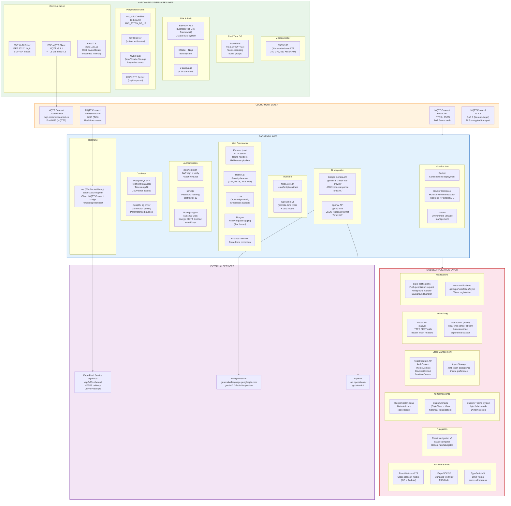

# 10 — Technology Stack Diagram
## Smart Desk Assistant (SDA)

### Purpose
The technology stack diagram catalogues every technology, framework, library, and protocol used in the system, organised by architectural layer. It provides the reader with a complete picture of the implementation tools and justifies their selection.

---

### Full Technology Stack Diagram

---

### Technology Selection Rationale

#### Hardware / Firmware

| Technology | Version / Spec | Justification |
|---|---|---|
| **ESP32-S3** | Dual-core LX7, 240 MHz | Sufficient compute for ADC + MQTT + TLS; integrated Wi-Fi; widely used in IoT academia |
| **ESP-IDF** | v5.x | Official Espressif framework; provides FreeRTOS, TLS via mbedTLS, MQTT client, NVS |
| **FreeRTOS** | Built into ESP-IDF | Deterministic real-time scheduling; allows concurrent button + publish tasks |
| **MQTT v3.1.1** | QoS 0 | Lightweight pub/sub protocol ideal for constrained IoT devices; minimal overhead |
| **mbedTLS** | Built into ESP-IDF | Provides TLS 1.2/1.3 for secure MQTTS; root CA embedded as binary constant |
| **NVS Flash** | ESP-IDF NVS | Key-value persistent storage; survives reboot; used for WiFi credential persistence |
| **CMake + Ninja** | CMake 3.x | Standard ESP-IDF build toolchain; cross-compilation to Xtensa architecture |

---

#### Cloud MQTT Layer

| Technology | Justification |
|---|---|
| **MQTT Connect Broker** | Dedicated IoT MQTT cloud broker with REST API and WebSocket; eliminates need for self-hosted broker infrastructure |
| **MQTTS (TLS, port 8883)** | Industry-standard secure MQTT transport; prevents eavesdropping of sensor data in transit |
| **JWT Bearer Authentication** | Stateless, expiry-aware token model; supports refresh to maintain long-lived backend connections |
| **WebSocket stream API** | Enables sub-second real-time data delivery from cloud to backend without polling latency |

---

#### Backend

| Technology | Version | Justification |
|---|---|---|
| **Node.js** | v18 LTS | Event-driven I/O model ideal for WebSocket handling and concurrent API requests |
| **TypeScript** | v5 | Compile-time type safety; reduces runtime errors; improves maintainability |
| **Express.js** | v4 | Lightweight, well-documented HTTP framework; large ecosystem; easy middleware composition |
| **PostgreSQL** | v14+ | ACID-compliant; strong JSON/JSONB support for actions arrays; TimestampTZ for sensor data |
| **jsonwebtoken** | v9 | Standard JWT library; supports HS256 with configurable expiry |
| **bcryptjs** | v2 | Adaptive password hashing; cost factor 12 provides brute-force resistance |
| **Node.js crypto** | Built-in | AES-256-CBC encryption for MQTT Connect secret keys; no additional dependencies |
| **ws** | v8 | Lightweight WebSocket library; used for both server (app clients) and client (MQTT Connect bridge) |
| **Helmet.js** | v7 | Security header middleware; prevents common web vulnerabilities (XSS, clickjacking) |
| **Docker + Compose** | Latest | Reproducible deployment; service isolation; simplifies production setup |
| **Google Gemini** | gemini-3.1-flash-lite-preview | Low-latency, cost-efficient LLM with JSON mode; suitable for real-time insight generation |
| **OpenAI GPT-4o-mini** | gpt-4o-mini | High-quality reasoning; configurable alternative to Gemini |

---

#### Mobile Application

| Technology | Version | Justification |
|---|---|---|
| **React Native** | v0.73 | Write-once cross-platform mobile; JavaScript/TypeScript ecosystem |
| **Expo SDK** | v52 | Managed workflow; simplifies native module access; over-the-air updates |
| **React Navigation** | v6 | De-facto navigation library for React Native; Stack + Tab navigators |
| **TypeScript** | v5 | Shared type definitions between backend and mobile reduce integration errors |
| **React Context API** | Built-in | Lightweight state management; avoids Redux overhead for this project's scale |
| **AsyncStorage** | Expo | Persistent local key-value store for JWT tokens and preferences |
| **expo-notifications** | SDK 52 | Push notification registration, permission handling, and foreground interception |
| **Fetch API** | Native | Built-in HTTP client; sufficient for REST API calls with Bearer auth headers |
| **WebSocket (native)** | Built-in | Native WebSocket with exponential backoff reconnect for real-time sensor updates |

---

### Communication Protocol Summary

| Layer | Protocol | Transport | Security | Port |
|---|---|---|---|---|
| Firmware → MQTT Connect | MQTT v3.1.1 | TCP | TLS (mbedTLS, root CA) | 8883 |
| Backend → MQTT Connect REST | HTTPS | TCP | TLS, JWT Bearer | 443 |
| Backend ↔ MQTT Connect WebSocket | WebSocket over WSS | TCP | TLS | 443 |
| Mobile App → Backend REST | HTTPS | TCP | TLS, JWT Bearer | 3000 |
| Mobile App ↔ Backend WebSocket | WebSocket (WS) | TCP | JWT query param | 3000 |
| Backend → Expo Push Service | HTTPS | TCP | TLS | 443 |
| Backend → Gemini / OpenAI | HTTPS | TCP | TLS, API Key | 443 |

---

### Development & Build Toolchain

| Tool | Purpose |
|---|---|
| **VS Code** | Primary IDE with ESP-IDF extension and React Native tooling |
| **ESP-IDF CMake** | Firmware cross-compilation and flashing |
| **esptool.py** | Flash binary to ESP32-S3 over USB-UART |
| **npm / package-lock.json** | Node.js dependency management (backend + mobile) |
| **Expo Go / EAS Build** | Mobile app development testing and production builds |
| **Git / GitHub** | Version control; branch `Offline_issue` for active development |
| **Docker Desktop** | Local containerised backend development and testing |
